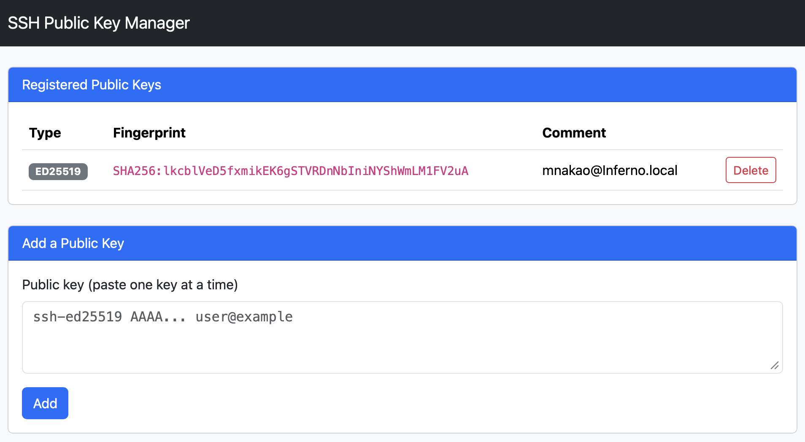

# SSH Public Key Manager

A simple Web app for viewing, adding, and removing SSH public keys in `${HOME}/.ssh/authorized_keys` from a web browser. It is designed to run as an Open OnDemand Passenger App.

## Features

- List registered public keys (type / SHA256 fingerprint / comment)
- Manage multiple public keys
- Add a new public key (with format validation and duplicate check)
- Delete a public key (by fingerprint)

## Usage

Open the app in your browser. The page shows your registered public keys and a form for adding a new one.



- **Registered Public Keys**: Lists each key's type, SHA256 fingerprint, and comment. Click **Delete** to remove a key (the fingerprint is used to identify which key to remove).
- **Add a Public Key**: Paste a single public key (e.g. the contents of `id_ed25519.pub`) into the text area and click **Add**. The key is validated before being saved, and duplicate keys are rejected.

## Requirements

- Open OnDemand 4.2 or later
- `ssh-keygen` (used for key validation and fingerprint lookup)

## Deploying to Open OnDemand

Place this directory on the Open OnDemand server in `/var/www/ood/apps/sys/`.

```bash
cd /var/www/ood/apps/sys/
git clone https://github.com/OpenOnDemandJP/SshPublicKeyManager.git
```

## Local Testing (Optional)

### Setup

Clone the repository and install the dependencies.

```bash
git clone https://github.com/OpenOnDemandJP/SshPublicKeyManager.git
cd SshPublicKeyManager
bundle install
```

### Test safely (recommended)

To try the app without touching your real `~/.ssh/authorized_keys`, point `HOME` at a temporary directory when starting it.

```bash
HOME=$(mktemp -d) bundle exec rackup -p 9292
```

Open http://localhost:9292 in your browser.

You can generate a test key like this:

```bash
ssh-keygen -t ed25519 -f /tmp/testkey -N '' -C 'test@local'
cat /tmp/testkey.pub
```

### Run against your real `~/.ssh/authorized_keys`

```bash
bundle exec rackup -p 9292
```

In this case, actions in the UI will modify your real `~/.ssh/authorized_keys`. It's recommended to back it up first.

```bash
cp ~/.ssh/authorized_keys ~/.ssh/authorized_keys.bak
```

## File Structure

```
.
├── app.rb     # Sinatra app (routes and logic for listing, adding, and deleting keys)
├── config.ru  # Passenger / Rack entry point
├── Gemfile    # Dependencies (sinatra; puma/rackup for development)
└── views/
    ├── layout.erb  # Shared layout (loads Bootstrap)
    └── index.erb   # Key list and add-key form
```

## Security Notes

- Public keys are validated with `ssh-keygen -lf` before being added. Invalid input is rejected.
- Duplicate registrations are rejected if the fingerprint matches an existing key.
- Permissions on `~/.ssh` (700) and `authorized_keys` (600) are set automatically as required by SSH.
- CSRF protection is enabled via `Rack::Protection::AuthenticityToken`. The session signing secret is stored in `~/.config/ssh_key_manager/session_secret` (600) and persists across Passenger restarts.
